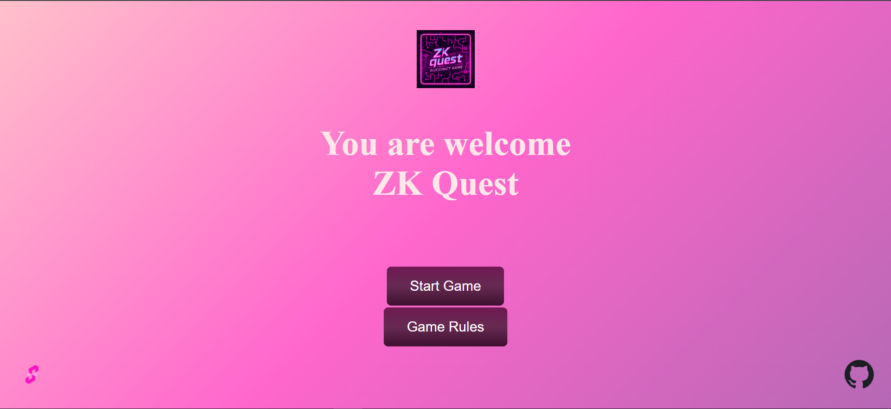
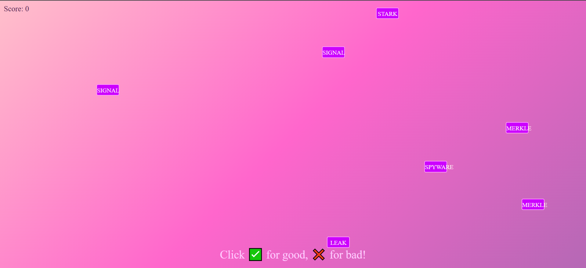
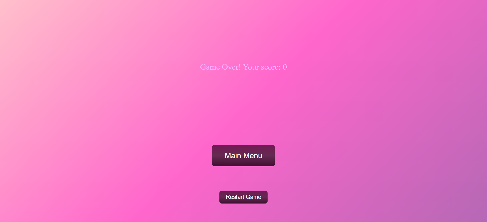

# 🧠 ZK Quest — Your Battle for ZK Server Stability!

ZK Quest is a browser-based game where you play as the defender of a Zero Knowledge service. Correct buttons represent legitimate user requests like ZKP, PROOF, SIGNAL, while wrong buttons are bugs and attacks that overload the server. Be careful: 3 mistakes and your server crashes!

## 🎮 Gameplay

👆 Your goal is to click only on the correct buttons as they appear on the screen.

🛑 Click 3 wrong buttons (bugs, attacks) — and you lose.

⚠️ Miss 2 buttons (right buttons) — and you also lose. They’ll fly off-screen, so stay alert!

---

## 🚀 How to Play

1. Open the game in your browser.  
2. Watch for buttons appearing on the screen.  
3. Click on safe requests like ZKP, PROOF, SIGNAL, etc.  
4. Avoid harmful buttons like MAL, HACK, VIRUS.  
5. Defend wave after wave and protect the system!

---

## 🧩 Features

- ⚔️ Fast-paced reactive gameplay  
- 🧠 Trains focus and reaction speed  
- 🎯 Unique ZK protocol theme  
- 🌐 Runs directly in your browser

---

## 📸 Screenshots





---

## 🛠 Technologies

- HTML, CSS, JavaScript  
- Compatible with modern browsers

---

## 📥 Installation & Launch

Just open index.html in your browser — and start playing!  
Or deploy it on any static hosting service (GitHub Pages, Vercel, Netlify, etc.)

```bash
git clone https://github.com/KojickLn/zkGame.git
cd zk-quest
# Open index.html in your browser
